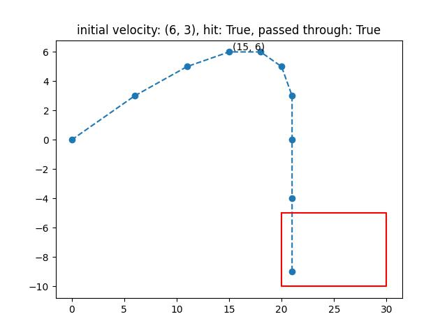
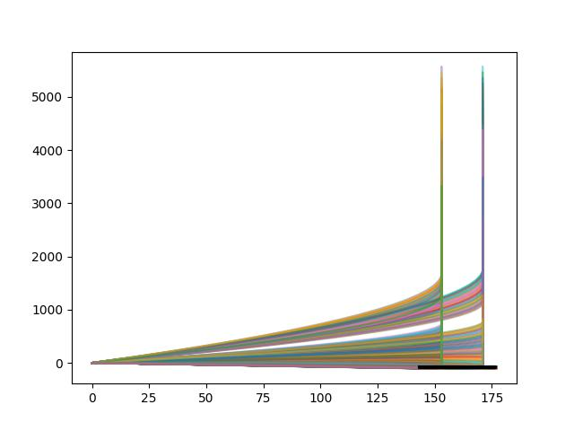
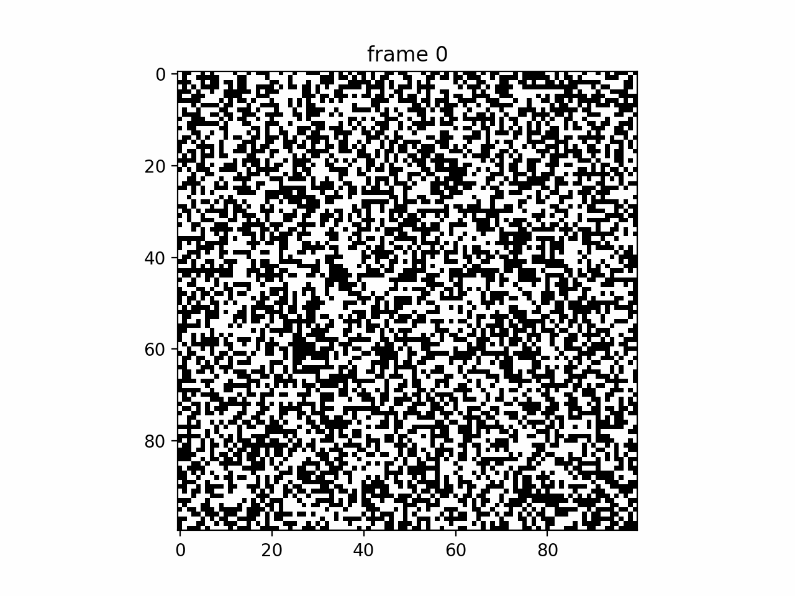

# Advent of Code 2021

**My solutions to the [Advent of Code 2021](https://adventofcode.com/2021) using Python.**

[](https://adventofcode.com)
[](https://www.python.org)
[](https://github.com/pre-commit/pre-commit)
[](https://github.com/psf/black)
[](http://mypy-lang.org/)
[](http://www.pydocstyle.org/en/stable/)

| Day | Code                                                                     | Stars |
| ---:| ------------------------------------------------------------------------ | ----- |
| 1   | [advent_of_code/challenges/day01.py](advent_of_code/challenges/day01.py) | ⭐️⭐️  |
| 2   | [advent_of_code/challenges/day02.py](advent_of_code/challenges/day02.py) | ⭐️⭐️  |
| 3   | [advent_of_code/challenges/day03.py](advent_of_code/challenges/day03.py) | ⭐️⭐️  |
| 4   | [advent_of_code/challenges/day04.py](advent_of_code/challenges/day04.py) | ⭐️⭐️  |
| 5   | [advent_of_code/challenges/day05.py](advent_of_code/challenges/day05.py) | ⭐️⭐️  |
| 6   | [advent_of_code/challenges/day06.py](advent_of_code/challenges/day06.py) | ⭐️⭐️  |
| 7   | [advent_of_code/challenges/day07.py](advent_of_code/challenges/day07.py) | ⭐️⭐️  |
| 8   | [advent_of_code/challenges/day08.py](advent_of_code/challenges/day08.py) | ⭐️⭐️  |
| 9   | [advent_of_code/challenges/day09.py](advent_of_code/challenges/day09.py) | ⭐️⭐️  |
| 10  | [advent_of_code/challenges/day10.py](advent_of_code/challenges/day10.py) | ⭐️⭐️  |
| 11  | [advent_of_code/challenges/day11.py](advent_of_code/challenges/day11.py) | ⭐️⭐️  |
| 12  | [advent_of_code/challenges/day12.py](advent_of_code/challenges/day12.py) | ⭐️⭐️  |
| 13  | [advent_of_code/challenges/day13.py](advent_of_code/challenges/day13.py) | ⭐️⭐️  |
| 14  | [advent_of_code/challenges/day14.py](advent_of_code/challenges/day14.py) | ⭐️⭐️  |
| 15  | [advent_of_code/challenges/day15.py](advent_of_code/challenges/day15.py) | ⭐️⭐️  |
| 16  | [advent_of_code/challenges/day16.py](advent_of_code/challenges/day16.py) | ⭐️⭐️  |
| 17  | [advent_of_code/challenges/day17.py](advent_of_code/challenges/day17.py) | ⭐️⭐️  |
| 18  | [advent_of_code/challenges/day18.py](advent_of_code/challenges/day18.py) | ⭐️⭐️  |
| 19  | [advent_of_code/challenges/day19.py](advent_of_code/challenges/day19.py) | ⭐️⭐️  |
| 20  | [advent_of_code/challenges/day20.py](advent_of_code/challenges/day20.py) | ⭐️⭐️  |
| 21  | [advent_of_code/challenges/day21.py](advent_of_code/challenges/day21.py) | ⭐️⭐️  |
| 22  | [advent_of_code/challenges/day22.py](advent_of_code/challenges/day22.py) | ⭐️⭐️  |
| 23  | [advent_of_code/challenges/day23.py](advent_of_code/challenges/day23.py) | ⭐️   |

**Help**

I do my best to solve these puzzle on my own, but I do have a job and other responsibilities.
So if a puzzle takes too long, I will find help from others working on Advent of Code 2021.
Below are the attributions to these other programmers.

1. I received help on part 2 of day 14 from [kresimir-lukin](https://github.com/kresimir-lukin/AdventOfCode2021/blob/main/day14.py).
2. I received help on day 20 from [fridokus](https://github.com/fridokus/advent-of-code/blob/master/2021/20.py).

## Visualizations

### Day 17





### Day 20



## Details

### Installation

This project can be installed as a Python package using `pip`.
Once it is installed, the code for the challenges can be executed using the CLI command as demonstrated later.

```bash
# pyenv local 3.9.9
python3 -m venv .env # or `pyenv exec python3 -m venv .env`
pip install --upgrade pip
pip install git+https://github.com/jhrcook/advent-of-code_2021.git
```

### Development setup

The steps to setting up the development version of this project are shown below.

```bash
pyenv local 3.9.9
pyenv exec python3 -m venv .env
source .env/bin/activate
pip install --upgrade pip
pip install flit
flit install
```

### Run the challenges

It is possible to run the code for a single day's challenge as demonstrated:

```bash
aoc21 --day 1
#> Day 1 part 1 answer: 1226
#> Day 1 part 2 answer: 1252
```

If no day is supplied as input, then the code for all of the challenges is executed in order.

```bash
aoc21
#> Day 1 part 1 answer: 1226
#> Day 1 part 2 answer: 1252
#> Day 2 part 1 answer: 1507611
#> ...
```

Alternatively, if you have the development system setup, you can use [`tox`]https://tox.wiki).

```bash
tox
#> .package recreate: /Users/admin/Developer/Python/advent-of-code_2021/.tox/.package
#> .package installdeps: flit_core >=3.2,<4
#> ...
```

### Organization

This repository is actually a Python package with all of the code in the [advent_of_code](./advent_of_code/) directory.
Within there, all of the challenges are in the [advent_of_code/challenges](./advent_of_code/challenges) sub-module where are day has a separate file.
Each of these "day"s can be run by Python to complete the challenge.
